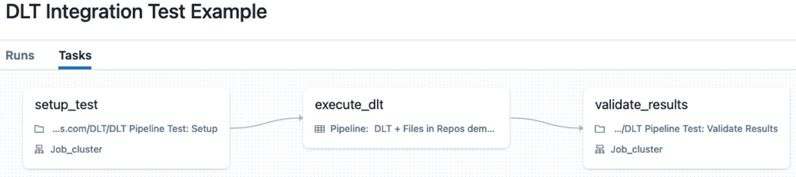

This repository provides code that tries to help with the development lifecycle of [Databricks Delta Live Tables (DLT)](https://docs.databricks.com/workflows/delta-live-tables/index.html). Steps include performing unit & integration testing of DLT pipelines and deployment of pipelines using [Databricks Asset Bundles](https://docs.databricks.com/en/dev-tools/bundles/index.html).  The repository also includes a sample of CI/CD pipeline using [Azure DevOps](https://azure.microsoft.com/en-us/services/devops/) (ADO) to automate the testing and deployment of DLT pipelines.

The repository has been created from the combination of two other repositories:
- Alex Ott's [repo](https://github.com/alexott/dlt-files-in-repos-demo/tree/main) demonstrating how to leverage the Repos functionality in DLT, the repo is described in detail in this blog post: [Applying software development & DevOps best practices to Delta Live Table pipelines](https://www.databricks.com/blog/applying-software-development-devops-best-practices-delta-live-table-pipelines).
- Szabi Kun's CI/CD workshop demo [DAB build & deployment pipelines](https://github.com/datapao/paofactory-dab-devops-buildout-demo/tree/main/.azure_devops/pipelines)

This repository aims to extend the above-mentioned repositories by adding the following features:
- Introducing DAB build & deployment pipelines to the DLT development lifecycle
- Adding integration tests to the DLT pipelines manifested as a separate DLT pipeline
- Using OAUTH M2M token to authenticate with Databricks
- Using Databricks Connect v2 to run unit tests instead of local Spark installation
- Running the DLT pipeline in validation mode (dry-run) to check for errors before deploying as part of the build pipeline

Improvement suggestions:
- Move DLT pipeline integration test to Workflows
    - Each pipeline should have a corresponding integration test job with tasks: setup, run DLT pipeline, validate 
    - The integration test job should be running on serverless
    - There should be a runner job that executes all integration test jobs
    - This runner job should be triggered by the build pipeline
    - In this case running the validate pipeline step is unnecessary as the whole pipeline is executed in the integration test
- Remove Zipping and pusblishing artifacts as it's not needed for DABs
- Run Unit tests using Databricks Connect Serverless
